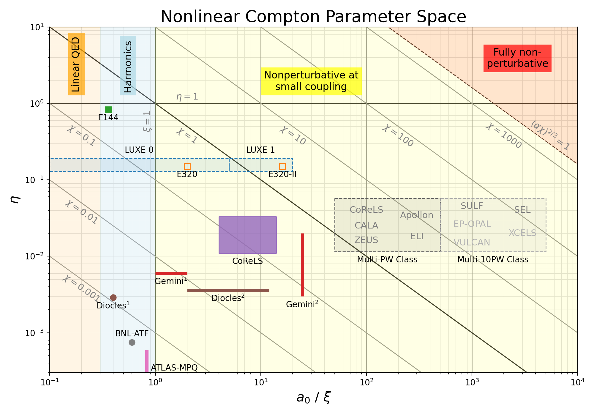
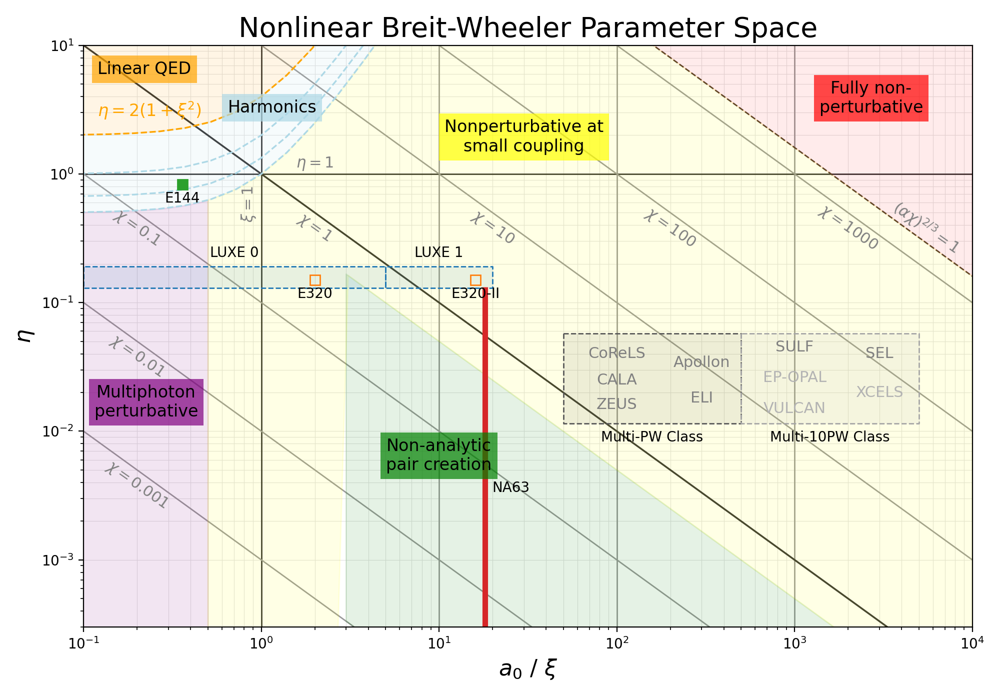

# Strong-Field QED Landscape

[](LICENSE)
[](https://doi.org/10.5281/zenodo.21255883)
[](https://github.com/ivoschulthess/SFQEDLandscape/releases)

The **SFQED Landscape Repository** is an open, community-driven resource that collects measurements, projections, and metadata from strong-field QED experiments and facilities in a common format. It provides Python tools for generating consistent overview plots of the current and future experimental landscape, with support for different strong-field QED parameterizations (e.g. $a_0$ / $\xi$, $\chi$, and $\eta$).

The repository was initiated following discussions at the [2026 SFQED Strategy Workshop: *The Path to the Non-Perturbative Regime of QED: Strategies and Experiments*](https://indico.desy.de/event/52809/), with the goal of establishing a shared community resource for maintaining and visualizing the evolving experimental landscape of strong-field QED.

Contributions of new datasets, corrections, and improvements are highly encouraged. Experimental collaborations are particularly encouraged to contribute and maintain their official datasets. If you would like to contribute a new dataset, update an existing one, report an error, or suggest an improvement, please contact me by [email](mailto:ivo.schulthess@desy.de) or open an issue or submit a pull request on GitHub. 


For readers unfamiliar with strong-field QED, we recommend the following reviews:

- [*A Primer of Strong-Field Quantum Electrodynamics* (2026)](https://doi.org/10.1016/j.physrep.2023.01.003) – an accessible introduction.
- [*Advances in QED with intense background fields* (2023)](https://doi.org/10.3390/physics8010026) – a comprehensive review.


## Available Landscapes

---

[](docs/NCS.md)

### [Nonlinear Compton Scattering](docs/NCS.md)

Nonlinear Compton scattering is the emission of a high-energy photon by an electron (or positron) interacting with an intense electromagnetic background field.
<br>
<br>
<br>
<br>
<br>
<br>
<br>

---

[](docs/NBW.md)

### [Nonlinear Breit-Wheeler Pair Production](docs/NBW.md)

Nonlinear Breit–Wheeler pair production is the creation of an electron–positron pair from a high-energy photon interacting with an intense electromagnetic background field.
<br>
<br>
<br>
<br>
<br>
<br>
<br>


## Citation

If you use this repository in your research, please cite the repository using the Zenodo DOI associated with the release you used.

```bibtex
@misc{SFQEDLandscape,
  author       = {Ivo Schulthess and others},
  title        = {Strong-Field QED Landscape},
  year         = {2026},
  publisher    = {Zenodo},
  doi          = {10.5281/zenodo.21255883}
  howpublished = {\url{https://github.com/ivoschulthess/sfqedLandscape}}
}
```

Please also cite the original publications corresponding to the experimental measurements or projections used in your work.


## License

The software contained in this repository is released under the MIT License (see the `LICENSE` file).

The numerical datasets contributed by individual experiments remain the responsibility of the respective collaborations unless explicitly stated otherwise. Please cite the original publications when using these data.


## Disclaimer

The datasets collected in this repository originate from a variety of sources, including publications, technical design reports, conference proceedings, and direct contributions from experimental collaborations. Measurements and projections may rely on different assumptions, simulation models, detector designs, or statistical methodologies and are therefore not always directly comparable. Where possible, such assumptions and relevant metadata are included alongside each dataset to facilitate interpretation.

This repository aims to provide a consistent overview of the current and planned experimental strong-field QED landscape. While every effort is made to ensure the accuracy of the datasets, users are encouraged to consult the original references for the underlying methodology and to report any errors, omissions, or outdated information.


## Acknowledgements

This repository was initiated following discussions at the [2026 SFQED Strategy Workshop](https://indico.desy.de/event/52809/). We thank all participants for their valuable discussions and support of this community initiative.

**Special thanks to:** Ben King for providing the initial version of the SFQED landscape plots, which formed the starting point for this repository.
